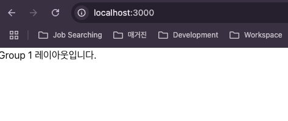
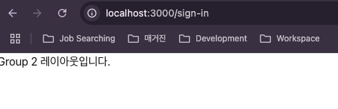
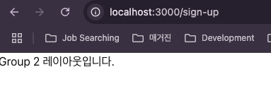
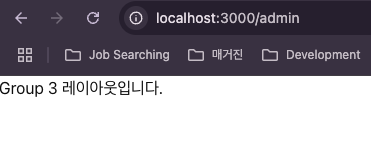
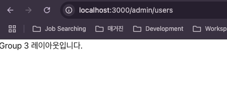
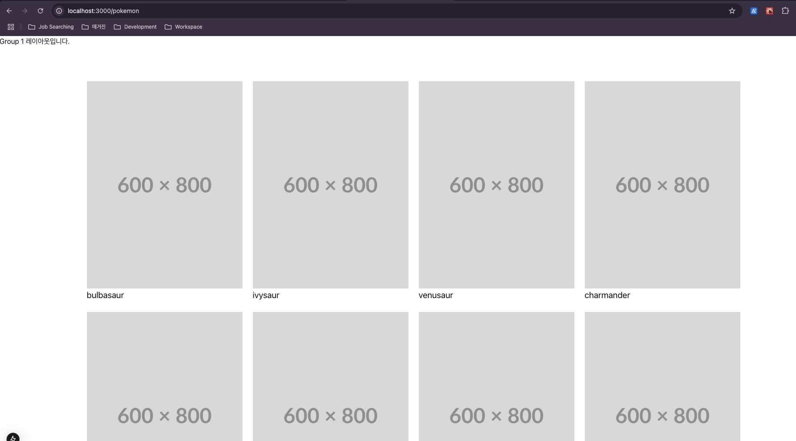

# 2025년 위팩토리 프론트엔드 개발자 채용 테스트

위팩토리 프론트엔드 개발자 채용 1차 온라인 테스트에 참여해주셔서 감사합니다.
온라인 테스트는 아래 표기된 기간동안 진행되며 지원자분께서 제출해주신 과제를 검토 후 합격하신 분들께는 `2차 오프라인 테스트 및 면접` 일정을 안내해드리도록 하겠습니다.

 

전체 면접 일정이 종료된 이후 해당 repository는 비공개 처리 될 예정이며 1차 테스트에 지원해주신 모든 분들께 순차적으로 제출해주신 과제에 대한 피드백을 드리고자 하니 포기하지 마시고 적극적인 참여 부탁드립니다.

 
 

온라인테스트 진행 기간

- 2025년 2월 25일 ~ 2025년 3월 4일
- 1차 테스트 합격자 발표: 2025년 3월 5일

 

진행 방식

- 해당 repository를 개인 github으로 fork하여 아래 요구사항들을 적용합니다.

 
 

## 1. 라우팅 구성 정확도 ( 15점 )

### 1-1. 아래 URL로 접속 가능한 페이지들을 구성하세요. ( 5점 )

- /
- /sign-in
- /sign-up
- /pokemons
- /admin
- /admin/users

 

### 1-2. 아래 그룹별로 서로 다른 레이아웃을 적용하세요. ( 10점 )

- Group 1
  - /
  - /pokemons
- Group 2
  - /sign-in
  - /sign-up
- Group 3

  - /admin
  - /admin/users

 

- 결과 예시

  
  
  
  
  
  

 
 

## 2. 상태관리 및 @tanstack/react-query 사용 적절성 ( 55점 )

### REST API 명세

1\) 엔드포인트

- URL: https://pokeapi.co/api/v2/pokemon
- Method: GET

2\) 요청 파라미터
| 이름 | 타입 | 기본값 | 설명 |
|---|---|---|---|
| limit | number | 20 | 가져올 포켓몬 개수(1 이상 권장) |
| offset | number | 0 | 이미 확인한 포켓몬 수(시작 지점) |

예\) GET https://pokeapi.co/api/v2/pokemon?limit=20&offset=0

---

### 2-1. zustand로 전역 상태 관리 ( 10점 )

> 제약사항: 전역상태관리는 zustand를 사용합니다.

- Group 1 레이아웃에 header와 sidebar를 만드세요. ( 2점 )
- header의 menubar를 클릭하면 sidebar가 열고 닫기게 기능을 구현하세요. ( 5점 )
  - 새로고침했을때 이전 상태가 유지되게 합니다. ( 5점 )

 

### 2-2. http 호출 및 응답 데이터 상태 관리 ( 20점 )

> 제약사항 1. page.tsx, layout.tsx에 'use client' 지시어를 사용하지 않습니다.

> 제약사항 2. [@tanstack/react-query](https://tanstack.com/query/latest) 라이브러리를 사용합니다.

위 REST API 명세를 바탕으로 데이터를 호출하는 custom hook을 구현하고 /pokemons 페이지에 예시와 같이 ui를 구현합니다.

- 이미지는 https://placehold.co/600x800.png 경로의 이미지를 사용합니다.

 

### 2-3. Pagination 적용하기 ( 25점 )

> 제약사항 1. 2-2에서 작성한 Component와는 별개의 Component를 작성합니다.

> 제약사항 2. [@tanstack/react-query](https://tanstack.com/query/latest) 라이브러리를 사용합니다.

위 REST API 명세를 참고하여 페이지네이션 ui 및 기능을 구현합니다. ( hint: api의 응답을 주의깊게 보세요. )

 
 

## 3. CSS/반응형 구현 능력 ( 30점 )

2번 문항에서 작성한 UI에 아래 제약사항들을 적용합니다.

### 3-1. Card 내부의 name에 container-query를 적용하여 font-size를 Card 사이즈에 반응하도록 구현합니다. ( 5점 )

- tailwindcss로만 구현합니다 ( 5점 )

### 3-2. 반응형 디자인을 @media를 사용하지 않고 구현합니다. ( hint: CSS Grid auto-fill ) ( 10점 )

- tailwindcss로만 구현합니다 ( 10점 )
